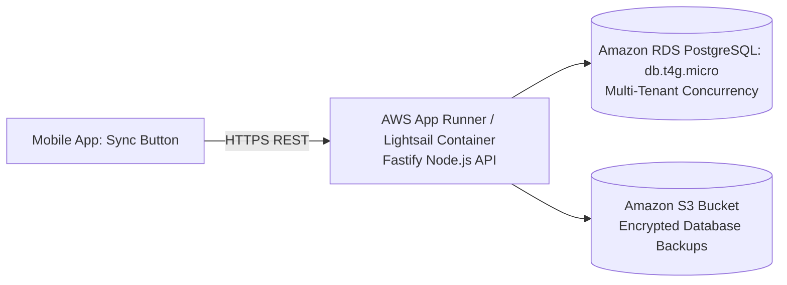

# 🚀 PROJECT STATE V2: Bill-App Enterprise Cloud & Multi-User Operating System

> **Document Status:** Master Architectural Blueprint & Living Execution Roadmap  
> **Target:** Cloud-Ready, Multi-User, Govt-Compliant Billing & Accounting Platform (Comparable to myBillBook & Vyapar)  
> **Core Motto:** *"Build with zero regression, keep local SQLite rock-solid, sync on-demand without WebSocket waste, and host lean on AWS for under $20/month."*  
> **Last Updated:** 2026-09-25  

---

## 📌 Table of Contents
1. [Core Architectural Philosophy & Golden Rules](#1-core-architectural-philosophy--golden-rules)
2. [Current Baseline Audit (What is 100% Complete)](#2-current-baseline-audit-what-is-100-complete)
3. [Pillar 1: Staff Roles & Permissions (RBAC) System](#3-pillar-1-staff-roles--permissions-rbac-system)
4. [Pillar 2: Cloud Account & On-Demand Sync / Backup (AWS)](#4-pillar-2-cloud-account--on-demand-sync--backup-aws)
5. [Pillar 3: Government Compliance & Trusted Reporting](#5-pillar-3-government-compliance--trusted-reporting)
6. [Pillar 4: Lean AWS Infrastructure & Cost Architecture](#6-pillar-4-lean-aws-infrastructure--cost-architecture)
7. [Smart Phased Implementation Roadmap](#7-smart-phased-implementation-roadmap)
   - [Phase 1: Staff Roles & Permissions (RBAC UI Guards & Management)](#phase-1-staff-roles--permissions-rbac-ui-guards--management)
   - [Phase 2: Cloud Authentication & Multi-Tenant Session Management](#phase-2-cloud-authentication--multi-tenant-session-management)
   - [Phase 3: 1-Click Encrypted Cloud Backup & Restore Engine (AWS S3)](#phase-3-1-click-encrypted-cloud-backup--restore-engine-aws-s3)
   - [Phase 4: On-Demand Multi-User Delta Sync Hardening](#phase-4-on-demand-multi-user-delta-sync-hardening)
   - [Phase 5: GST Government Compliance, Audit Trail & Verification](#phase-5-gst-government-compliance-audit-trail--verification)
   - [Phase 6: AWS Cloud Server Deployment & Production Release](#phase-6-aws-cloud-server-deployment--production-release)
8. [Risk Mitigation & Regression Prevention Protocol](#8-risk-mitigation--regression-prevention-protocol)

---

## 1. Core Architectural Philosophy & Golden Rules

### Rule 1: Local SQLite is Sovereign on the Device (Zero App Breakage)
- The mobile/tablet Flutter app **stays 100% SQLite (`sqflite`) forever**.
- We **NEVER replace SQLite with Postgres on the phone**.
- All billing, customer searches, inventory deductions, and thermal prints execute against the local `ledger_pilot.db` in sub-10 milliseconds without depending on active internet.
- The client app only speaks standard JSON over HTTPS to the backend. It has zero knowledge of the cloud database engine.

### Rule 2: No WebSockets — On-Demand "Sync Button" Protocol
- WebSockets cause persistent battery drain, drop connections during cellular handovers (4G to Wi-Fi), and require expensive 24/7 server infrastructure (Redis pub/sub, sticky sessions).
- Just like **Vyapar** and **myBillBook**, we use an **On-Demand HTTP REST Sync Button** (`SyncEngine.instance.syncNow()`).
- Sync only executes when:
  1. The user taps the **Sync Button** in the AppBar or Dashboard.
  2. The app is opened (optional background check).
- Sync completes in 1–2 seconds and closes the connection immediately.

### Rule 3: Mathematical & Accounting Precision
- **Paise-Level Integer Arithmetic:** All money amounts are stored as integers (`paise`). Floating-point numbers are never used for currency to eliminate rounding errors.
- **Double-Entry Source-of-Truth Ledger:** Invoices, payments, expenses, and returns create immutable balancing entries in the `ledger` table. Financial reports (P&L, Balance Sheet, Daybook) are derived dynamically from ledger sums.

### Rule 4: Think More, Code Less — Maximum Efficiency & Surgical Edits
- **80/20 Rule:** Spend 80% of effort deeply analyzing requirements, data models, and edge cases, and 20% writing clean, minimal, surgical code.
- **Zero Bloat:** Never write 100 lines of code where 20 lines achieve the exact same goal cleanly. Avoid over-engineering, unnecessary abstractions, or duplicate helpers.
- **Reuse Over Reinvention:** Always leverage existing tested components (`StitchColors`, `BillingEngine`, `Repository.instance`, `Session`, `Money`, `SyncEngine`).
- **Deterministic & Maintainable:** Keep functions pure, state predictable, and error handling explicit without swallow-and-ignore patterns.

### Rule 5: Premium, Clutter-Free UI — Zero Unnecessary Things
- **Every Pixel Must Earn Its Place:** Eliminate decorative clutter, redundant buttons, duplicate badges, or distracting animations. If an element does not help the user bill faster or understand their finances better, **remove it**.
- **Fast 5-Second Billing:** The UI must be optimized for busy shopkeepers and cashiers. Key actions (selecting items, adding charges, recording cash/UPI, printing receipt) must take 1 to 2 taps maximum.
- **Clean Aesthetic & High Scannability:** 
  - Crisp typography using Google Fonts `Inter` with distinct weight contrast (800 for headers/totals, 600 for labels, 400 for metadata).
  - Elegant, restrained color palette: `#5B4DBC` (Stitch primary indigo), `#1E293B` (slate dark text), `#64748B` (secondary muted), `#16A34A` (success green), `#DC2626` (alert red).
  - Indian currency formatting on all financial figures (`₹1,50,000.00`).
- **No Modal Fatigue:** Avoid annoying multi-step popups and blocking loaders. Use lightweight, intuitive bottom sheets, inline cards, and unobtrusive status toasts.
- **Comfortable Touch Targets:** All interactive elements must have minimum 48×48 dp touch targets with clear visual feedback (subtle ink ripples, distinct disabled states).

---

## 2. Current Baseline Audit (What is 100% Complete)

| Domain | Implemented Features | Status |
| :--- | :--- | :---: |
| **Local Database** | 20 relational SQLite tables (`invoices`, `customers`, `products`, `ledger`, `payments`, `expenses`, `cheques`, etc.) | 🟢 100% |
| **Billing Engine** | Multi-item cart, HSN codes, GST split (Intra: CGST+SGST, Inter: IGST), realtime Add Charge, line & bill discounts, partial payments | 🟢 100% |
| **Print & Share** | 58mm / 80mm Thermal Receipt, A4 / A5 Tax Invoice PDF, dynamic payment UPI QR, WhatsApp invoice share | 🟢 100% |
| **Accounting Reports** | Daybook, Bill-wise profit, Sales summary, Stock summary, Profit & Loss, Balance Sheet, Cash & Bank hub | 🟢 100% |
| **GST Compliance** | GSTR-1, GSTR-3B summary, GSTR-2B reconciliation view, HSN Tax summary | 🟢 100% |
| **Tally Integration** | **Tally Prime Direct XML Export** (Masters & Vouchers in standard Tally XML envelope with 1-click share & clipboard copy) | 🟢 100% |
| **Test Coverage** | 134 automated unit and integration tests passing; 0 analyzer warnings | 🟢 100% |

---

## 3. Pillar 1: Staff Roles & Permissions (RBAC) System

Businesses require staff to create bills and collect payments without viewing company profit margins, purchase costs, or bank balances.

### 3.1 Role Hierarchy & Permissions Matrix

| Functional Capability | Owner | Business Admin | Cashier / Biller | Field Salesman | Delivery Agent | Accountant / External CA |
| :--- | :---: | :---: | :---: | :---: | :---: | :---: |
| **Create Sales Invoices** | ✅ Full | ✅ Full | ✅ Full | ✅ Assigned Parties | ❌ No | 👁️ View Only |
| **Edit / Cancel Past Bills** | ✅ Full | ✅ Full | ⏱️ 15m Lock / Admin OTP | ❌ No | ❌ No | ✅ Full |
| **View Purchase & Costs** | ✅ Full | ✅ Full | 🚫 **Hidden** | 🚫 **Hidden** | 🚫 **Hidden** | ✅ Full |
| **Profit & Loss / Margins** | ✅ Full | ✅ Full | 🚫 **Hidden** | 🚫 **Hidden** | 🚫 **Hidden** | ✅ Full |
| **Manage Stock & Items** | ✅ Full | ✅ Full | 👁️ View Stock Only | 👁️ View Stock Only | 👁️ Dispatch Qty | 👁️ View Only |
| **Receive Payment (Cash/Bank)** | ✅ Full | ✅ Full | ✅ Till Limit Only | ✅ Assigned Parties | ✅ COD Only | ✅ Full |
| **View Bank Account Balances** | ✅ Full | ✅ Full | 🚫 **Hidden** | 🚫 **Hidden** | 🚫 **Hidden** | ✅ Reconcile Only |
| **Manage Staff & Roles** | ✅ Full | ✅ Add/Remove | ❌ No | ❌ No | ❌ No | ❌ No |
| **Tally Prime XML Export** | ✅ Full | ✅ Full | ❌ No | ❌ No | ❌ No | ✅ Full |

### 3.2 UI Role Enforcement Architecture
1. **Screen Level Guards:** If `session.currentRole == 'Cashier'`, navigating to Profit & Loss, Balance Sheet, or Bank Accounts displays an "Access Restricted" view.
2. **Component Level Guards:** In item pickers and product catalogs, hide Purchase Price (`purchase_price`) and Profit Margin indicators when non-owner/admin roles are active.
3. **Action Level Guards:** Modifying or deleting a past invoice requires the Admin PIN or role permission.

---

## 4. Pillar 2: Cloud Account & On-Demand Sync / Backup (AWS)

### 4.1 Cloud User Profile & Authentication
- **Multi-Tenant Account:** Mobile Number / Email + Password / OTP.
- **Business Profile Sync:** Business details (GSTIN, Address, Logo, Bank Accounts, Terms) synced to cloud.
- **Session Tokens:** Secure JWT stored in `flutter_secure_storage` with automated renewal.

### 4.2 On-Demand Sync Workflow (`SyncEngine`)
1. User creates invoices, updates stock, records receipts locally in SQLite.
2. Changes are appended to `sync_queue` table with a unique idempotency key:
   `idempotency_key = ${business_id}:${device_id}:${entity}:${entity_id}:${op}`
3. User taps **"Sync Now"** in AppBar:
   - **Step 1 (Push):** Send pending items to `POST /api/v1/sync/push`. Cloud marks records processed.
   - **Step 2 (Pull):** Request changes from other devices via `GET /api/v1/sync/pull?since=${last_synced_at}`.
   - **Step 3 (Reconcile):** Apply remote changes locally into SQLite.
   - **Step 4 (Feedback):** Update sync icon to green checkmark with message: *"Synced successfully (X sent, Y received)"*.

### 4.3 1-Click Encrypted Cloud Backup & Restore (Amazon S3)
- **Manual Cloud Backup:** User taps "Backup to Cloud" in More screen.
- App generates a clean snapshot of `ledger_pilot.db`, encrypts it using AES-256 with the business encryption key, and uploads to an isolated Amazon S3 path:
  `s3://billapp-backups/${business_id}/backup_${timestamp}.enc`
- **Cloud Restore:** Allows an owner logging into a new phone to restore their complete business history in one tap.

---

## 5. Pillar 3: Government Compliance & Trusted Reporting

To serve as a trusted business operating system, financial reports must strictly adhere to Indian tax and accounting standards.

### 5.1 Government Tax Compliance Matrix
1. **GST Invoicing Rules (Rule 46 & 48 of CGST Rules):**
   - Mandatory sequential invoice numbering per Financial Year.
   - Distinction between Tax Invoice (registered B2B) and Bill of Supply (composition / exempt).
   - Display of 15-digit GSTIN, State Name, and 2-digit State Code.
   - HSN summary showing Taxable Value, CGST, SGST, IGST, and Total Tax.
2. **GSTR Filing Reports:**
   - **GSTR-1:** Export-ready tables for B2B (table 4), B2C Large (table 5), B2C Small (table 7), Credit/Debit Notes (table 9), and HSN Summary (table 12).
   - **GSTR-3B:** Eligible ITC (purchases) vs. Outward Taxable Supplies (sales) summary.
3. **Audit Trail & Government Non-Alteration Compliance:**
   - MCA notification requires accounting software to maintain an unalterable audit trail of every transaction edit or cancellation with timestamp and user ID.
   - All edits record the previous state (`before`) and new state (`after`) in `audit_log`.

### 5.2 Tally Prime Direct XML Integration (Completed & Operational)
- Standard TallyPrime `<ENVELOPE>` XML generation.
- Covers Masters (Sundry Debtors, Sundry Creditors, Sales, Purchases, Taxes) and Vouchers (Sales, Purchases, Receipts, Payments).
- Instant share via WhatsApp, Gmail, Drive, or clipboard copy.

---

## 6. Lean AWS Infrastructure & Cost Architecture

### 6.1 Cloud Architecture (No WebSockets, No Redis Waste)

### 6.2 AWS Cost Sizing (Under $20/Month)

| Component | AWS Service Configuration | Monthly Cost (0 - 5,000 Users) | Free Tier Eligible? |
| :--- | :--- | :---: | :---: |
| **API Backend** | AWS App Runner (0.25 vCPU, 0.5 GB RAM) or Lightsail ($5) | $5.00 – $8.00 | Yes (First 30 days) |
| **Database** | Amazon RDS PostgreSQL `db.t4g.micro` (Single-AZ) | $12.00 – $14.00 | **Yes (Free 750 hrs/mo for 12 mos)** |
| **Cloud Backups** | Amazon S3 Standard Storage (50 GB encrypted) | $1.15 | **Yes (5 GB Free)** |
| **DNS & SSL** | Route 53 + AWS Certificate Manager (Free SSL) | $0.50 | No |
| **Total Estimated Cost** | | **~$18.65 / month** | **~$0 - $5 / month with Free Tier** |

---

## 7. Smart Phased Implementation Roadmap

To avoid errors and maintain zero regressions, implementation is strictly partitioned into **6 independent, test-verified phases**.

---

### Phase 1: Staff Roles & Permissions (RBAC UI Guards & Management)
*Focus: Enforce operational boundaries on device without requiring server deployment yet.*

- [ ] **Task 1.1: Expand Session Role Model**
  - Update `app/lib/core/session.dart` to support full enum `UserRole { owner, admin, cashier, salesman, deliveryBoy, accountant }`.
  - Add explicit permission helper methods: `canViewCosts`, `canViewPL`, `canViewBankBalances`, `canManageStaff`, `canEditPastInvoices`.
- [ ] **Task 1.2: Build Staff Management UI**
  - Create `app/lib/features/staff/staff_list_screen.dart` to view and invite staff members.
  - Create `app/lib/features/staff/staff_form_sheet.dart` to assign roles, mobile numbers, and permissions.
  - Store staff records in local SQLite table `staff_members` (persisted and sync-ready).
- [ ] **Task 1.3: Apply Screen & Component Guards**
  - **Reports Menu (`reports_menu_screen.dart`)**: Hide Profit & Loss and Balance Sheet when role is `cashier` or `salesman`.
  - **Product Picker & Form**: Hide purchase cost (`purchasePrice`) from cashier/salesman.
  - **Dashboard (`dashboard_screen.dart`)**: Hide Gross Profit & Net Profit cards when role is restricted.
  - **Invoice Actions**: Restrict invoice deletion/editing for cashier after 15 minutes.
- [ ] **Task 1.4: Unit & Widget Verification**
  - Write `test/features/staff_rbac_test.dart` verifying permission logic and role switching.
  - Run `flutter analyze` & `flutter test` (must achieve 0 errors, 100% pass).

---

### Phase 2: Cloud Authentication & Multi-Tenant Session Management
*Focus: Connect the mobile app to cloud identity securely.*

- [ ] **Task 2.1: Cloud Auth API Client Integration**
  - Enhance `app/lib/core/api_client.dart` with login, signup, OTP request, and token refresh methods.
  - Implement secure credential storage using `shared_preferences` / `flutter_secure_storage`.
- [ ] **Task 2.2: Auth Screens in Flutter**
  - Create `app/lib/features/auth/login_screen.dart` (Mobile Number + Password / OTP).
  - Create `app/lib/features/auth/register_screen.dart` (Business Name, Owner Mobile, State).
  - Wire into `app_gate.dart` so onboarded users can seamlessly link their local business to a cloud account.
- [ ] **Task 2.3: Backend Auth Verification**
  - Verify `backend/src/services/auth.ts` handles user creation, bcrypt password hashing, and JWT signing with tenant `businessId`.
- [ ] **Task 2.4: Verification**
  - Run end-to-end auth integration test.

---

### Phase 3: 1-Click Encrypted Cloud Backup & Restore Engine (AWS S3)
*Focus: Provide enterprise-grade data safety so businesses never lose records.*

- [ ] **Task 3.1: Cloud Backup Service (`app/lib/core/backup_service.dart`)**
  - Create database snapshot of `ledger_pilot.db`.
  - Encrypt snapshot with AES-GCM using business secret.
  - Send snapshot to backend endpoint `POST /api/v1/backup/upload`.
- [ ] **Task 3.2: Backend S3 Upload Handler**
  - Implement S3 presigned URL or direct upload handler in Fastify using `@aws-sdk/client-s3`.
  - Store backup metadata (timestamp, file size, checksum) in database.
- [ ] **Task 3.3: Backup & Restore UI**
  - In `app/lib/features/more/more_screen.dart`, enhance "Backup & Restore" tile:
    - Display last cloud backup timestamp.
    - One-tap "Backup to Cloud Now" button with progress indicator.
    - One-tap "Restore from Cloud" button with confirmation dialog.
- [ ] **Task 3.4: Verification**
  - Test backup export, encryption, S3 upload, and clean database restoration.

---

### Phase 4: On-Demand Multi-User Delta Sync Hardening
*Focus: Make multi-device sync robust against concurrency without real-time socket overhead.*

- [ ] **Task 4.1: Streamline `SyncEngine` for On-Demand Trigger**
  - Verify `SyncEngine.instance.syncNow()` in `app/lib/sync/sync_engine.dart`.
  - Ensure push queue processes batch chunks (50 records per batch) with exponential backoff on retry.
  - Pull delta since `last_server_time` and reconcile via `reconcileRemoteChange`.
- [ ] **Task 4.2: Conflict Resolution Logic**
  - **Invoices:** Last-write-wins based on server timestamp; conflict revisions recorded in `audit_log`.
  - **Inventory:** Stock changes applied as deltas in `stock_moves` rather than overwriting absolute balances.
  - **Parties:** Payments create immutable ledger entries that balance automatically.
- [ ] **Task 4.3: Sync Status UI Polish**
  - Add sync badge in AppBar showing:
    - 🟢 Green: Up to date.
    - 🟡 Amber: Pending local changes (e.g. "3 unsynced bills").
    - 🔵 Spinning: Sync in progress.
  - Tapping badge executes `syncNow()` and shows an unobtrusive SnackBar summary.
- [ ] **Task 4.4: Verification**
  - Write multi-device sync simulation test in `test/sync/sync_engine_test.dart`.

---

### Phase 5: GST Government Compliance, Audit Trail & Verification
*Focus: Ensure reports stand up to CA audits and statutory scrutiny.*

- [ ] **Task 5.1: MCA Audit Trail Enforcement**
  - Ensure every invoice edit or cancellation generates a permanent entry in `audit_log` with `actor`, `action`, `before`, `after`, and `timestamp`.
  - Build `app/lib/features/reports/audit_trail_screen.dart` allowing owners and CAs to view the tamper-evident history of any transaction.
- [ ] **Task 5.2: GSTR Filing Export Polish**
  - Verify GSTR-1 JSON/CSV matches official GST portal schemas (Table 4 B2B, Table 7 B2CS, Table 12 HSN Summary).
  - Verify HSN summary accurately sums taxable value and tax rates.
- [ ] **Task 5.3: Verification**
  - Verify GSTR calculations against sample CA datasets.

---

### Phase 6: AWS Cloud Server Deployment & Production Release
*Focus: Stand up the production AWS environment on budget.*

- [ ] **Task 6.1: Dockerize Fastify Backend**
  - Create production multi-stage `backend/Dockerfile` (Alpine Node.js runtime, pruned dependencies, minimal footprint <120 MB).
- [ ] **Task 6.2: AWS RDS PostgreSQL Setup**
  - Provision RDS PostgreSQL `db.t4g.micro` in AWS region `ap-south-1` (Mumbai).
  - Configure `DATABASE_URL` and run Prisma migrations (`npx prisma db push`).
- [ ] **Task 6.3: Deploy to AWS App Runner / Lightsail**
  - Configure automatic deployment from container registry.
  - Configure custom domain (`api.billapp.in`) with free ACM SSL certificate.
- [ ] **Task 6.4: Production Sanity Test**
  - Run mobile app on physical Android device connected to live AWS endpoint; verify login, bill creation, on-demand sync, and Tally export.

---

## 8. Risk Mitigation & Regression Prevention Protocol

1. **Before Any Edit:** Run `flutter test` and check git status to verify clean working tree.
2. **Local Schema Safety:** Never drop or destructively alter existing SQLite columns in `ledger_pilot.db`. Always use non-destructive migrations (`ALTER TABLE ... ADD COLUMN IF NOT EXISTS`).
3. **Paise Accuracy:** Never use `double` for currency calculations; always use `int` paise with `BillingEngine`.
4. **Lint Integrity:** Every change must maintain **0 errors and 0 warnings** in `flutter analyze`.
5. **Phase Gate:** No phase begins until the previous phase's acceptance tests are 100% committed and passing.
6. **Code-Efficiency Check:** Before committing, review all diffs to ensure no bloated boilerplate, duplicate helpers, or unused abstractions were added ("Think more, code less").
7. **UI Clutter-Free Audit:** Verify that newly created screens/components are free of visual noise, have no unnecessary buttons or decorative bloat, adhere strictly to Stitch styling, and enable lightning-fast billing.
