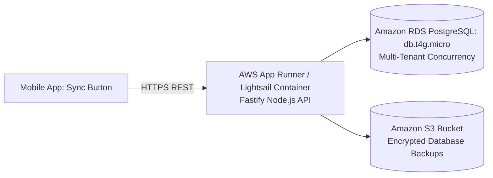

# 🚀 PROJECT STATE V2: Bill-App Enterprise Cloud & Multi-User Operating System

> **Document Status:** Master Architectural Blueprint & Living Execution Roadmap  
> **Target:** Cloud-Ready, Multi-User, Govt-Compliant Billing & Accounting Platform (Comparable to myBillBook & Vyapar)  
> **Core Motto:** *"Build with zero regression, keep local SQLite rock-solid, sync on-demand without WebSocket waste, and host lean on AWS for under $20/month."*  
> **Last Updated:** 2026-09-25  

---

## 📌 Table of Contents
1. [Core Architectural Philosophy & Golden Rules](#1-core-architectural-philosophy--golden-rules)
2. [Current Baseline Audit (What is 100% Complete)](#2-current-baseline-audit-what-is-100-complete)
3. [Pillar 1: Staff Roles & Permissions (RBAC) System](#3-pillar-1-staff-roles--permissions-rbac-system)
4. [Pillar 2: Cloud Account & On-Demand Sync / Backup (AWS)](#4-pillar-2-cloud-account--on-demand-sync--backup-aws)
5. [Pillar 3: Government Compliance & Trusted Reporting](#5-pillar-3-government-compliance--trusted-reporting)
6. [Pillar 4: Lean AWS Infrastructure & Cost Architecture](#6-pillar-4-lean-aws-infrastructure--cost-architecture)
7. [Smart Phased Implementation Roadmap](#7-smart-phased-implementation-roadmap)
   - [Phase 1: Staff Roles & Permissions (RBAC UI Guards & Management)](#phase-1-staff-roles--permissions-rbac-ui-guards--management)
   - [Phase 2: Cloud Authentication & Multi-Tenant Session Management](#phase-2-cloud-authentication--multi-tenant-session-management)
   - [Phase 3: 1-Click Encrypted Cloud Backup & Restore Engine (AWS S3)](#phase-3-1-click-encrypted-cloud-backup--restore-engine-aws-s3)
   - [Phase 4: On-Demand Multi-User Delta Sync Hardening](#phase-4-on-demand-multi-user-delta-sync-hardening)
   - [Phase 5: GST Government Compliance, Audit Trail & Verification](#phase-5-gst-government-compliance-audit-trail--verification)
   - [Phase 6: AWS Cloud Server Deployment & Production Release](#phase-6-aws-cloud-server-deployment--production-release)
8. [Risk Mitigation & Regression Prevention Protocol](#8-risk-mitigation--regression-prevention-protocol)

---

## 1. Core Architectural Philosophy & Golden Rules

### Rule 1: Local SQLite is Sovereign on the Device (Zero App Breakage)
- The mobile/tablet Flutter app **stays 100% SQLite (`sqflite`) forever**.
- We **NEVER replace SQLite with Postgres on the phone**.
- All billing, customer searches, inventory deductions, and thermal prints execute against the local `ledger_pilot.db` in sub-10 milliseconds without depending on active internet.
- The client app only speaks standard JSON over HTTPS to the backend. It has zero knowledge of the cloud database engine.

### Rule 2: No WebSockets — On-Demand "Sync Button" Protocol
- WebSockets cause persistent battery drain, drop connections during cellular handovers (4G to Wi-Fi), and require expensive 24/7 server infrastructure (Redis pub/sub, sticky sessions).
- Just like **Vyapar** and **myBillBook**, we use an **On-Demand HTTP REST Sync Button** (`SyncEngine.instance.syncNow()`).
- Sync only executes when:
  1. The user taps the **Sync Button** in the AppBar or Dashboard.
  2. The app is opened (optional background check).
- Sync completes in 1–2 seconds and closes the connection immediately.

### Rule 3: Mathematical & Accounting Precision
- **Paise-Level Integer Arithmetic:** All money amounts are stored as integers (`paise`). Floating-point numbers are never used for currency to eliminate rounding errors.
- **Double-Entry Source-of-Truth Ledger:** Invoices, payments, expenses, and returns create immutable balancing entries in the `ledger` table. Financial reports (P&L, Balance Sheet, Daybook) are derived dynamically from ledger sums.

### Rule 4: Think More, Code Less — Maximum Efficiency & Surgical Edits
- **80/20 Rule:** Spend 80% of effort deeply analyzing requirements, data models, and edge cases, and 20% writing clean, minimal, surgical code.
- **Zero Bloat:** Never write 100 lines of code where 20 lines achieve the exact same goal cleanly. Avoid over-engineering, unnecessary abstractions, or duplicate helpers.
- **Reuse Over Reinvention:** Always leverage existing tested components (`StitchColors`, `BillingEngine`, `Repository.instance`, `Session`, `Money`, `SyncEngine`).
- **Deterministic & Maintainable:** Keep functions pure, state predictable, and error handling explicit without swallow-and-ignore patterns.

### Rule 5: Premium, Clutter-Free UI — Zero Unnecessary Things
- **Every Pixel Must Earn Its Place:** Eliminate decorative clutter, redundant buttons, duplicate badges, or distracting animations. If an element does not help the user bill faster or understand their finances better, **remove it**.
- **Fast 5-Second Billing:** The UI must be optimized for busy shopkeepers and cashiers. Key actions (selecting items, adding charges, recording cash/UPI, printing receipt) must take 1 to 2 taps maximum.
- **Clean Aesthetic & High Scannability:** 
  - Crisp typography using Google Fonts `Inter` with distinct weight contrast (800 for headers/totals, 600 for labels, 400 for metadata).
  - Elegant, restrained color palette: `#5B4DBC` (Stitch primary indigo), `#1E293B` (slate dark text), `#64748B` (secondary muted), `#16A34A` (success green), `#DC2626` (alert red).
  - Indian currency formatting on all financial figures (`₹1,50,000.00`).
- **No Modal Fatigue:** Avoid annoying multi-step popups and blocking loaders. Use lightweight, intuitive bottom sheets, inline cards, and unobtrusive status toasts.
- **Comfortable Touch Targets:** All interactive elements must have minimum 48×48 dp touch targets with clear visual feedback (subtle ink ripples, distinct disabled states).

---

## 2. Current Baseline Audit (What is 100% Complete)

| Domain | Implemented Features | Status |
| :--- | :--- | :---: |
| **Local Database** | 20 relational SQLite tables (`invoices`, `customers`, `products`, `ledger`, `payments`, `expenses`, `cheques`, etc.) | 🟢 100% |
| **Billing Engine** | Multi-item cart, HSN codes, GST split (Intra: CGST+SGST, Inter: IGST), realtime Add Charge, line & bill discounts, partial payments | 🟢 100% |
| **Print & Share** | 58mm / 80mm Thermal Receipt, A4 / A5 Tax Invoice PDF, dynamic payment UPI QR, WhatsApp invoice share | 🟢 100% |
| **Accounting Reports** | Daybook, Bill-wise profit, Sales summary, Stock summary, Profit & Loss, Balance Sheet, Cash & Bank hub | 🟢 100% |
| **GST Compliance** | GSTR-1, GSTR-3B summary, GSTR-2B reconciliation view, HSN Tax summary | 🟢 100% |
| **Tally Integration** | **Tally Prime Direct XML Export** (Masters & Vouchers in standard Tally XML envelope with 1-click share & clipboard copy) | 🟢 100% |
| **Staff & RBAC** | **Staff Roles & Permissions (RBAC)** (Owner, Admin, Cashier, Salesman, Delivery, Accountant with UI guards, simulation mode, 15m bill lock) | 🟢 100% |
| **Cloud Authentication** | **Google-based Auth** (Primary "Sign in with Google", upgradable mobile OTP hook, non-blocking offline mode, JWT session linking) | 🟢 100% |
| **Cloud Backup & Vault** | **1-Click Encrypted Cloud Vault** (Atomic SQLite snapshots, AWS S3 backend, point-in-time restore, local export fallback) | 🟢 100% |
| **Test Coverage** | 153 Flutter tests + 20 Backend tests passing (100% pass rate); 0 analyzer warnings | 🟢 100% |

---

## 3. Pillar 1: Staff Roles & Permissions (RBAC) System

Businesses require staff to create bills and collect payments without viewing company profit margins, purchase costs, or bank balances.

### 3.1 Role Hierarchy & Permissions Matrix

| Functional Capability | Owner | Business Admin | Cashier / Biller | Field Salesman | Delivery Agent | Accountant / External CA |
| :--- | :---: | :---: | :---: | :---: | :---: | :---: |
| **Create Sales Invoices** | ✅ Full | ✅ Full | ✅ Full | ✅ Assigned Parties | ❌ No | 👁️ View Only |
| **Edit / Cancel Past Bills** | ✅ Full | ✅ Full | ⏱️ 15m Lock / Admin OTP | ❌ No | ❌ No | ✅ Full |
| **View Purchase & Costs** | ✅ Full | ✅ Full | 🚫 **Hidden** | 🚫 **Hidden** | 🚫 **Hidden** | ✅ Full |
| **Profit & Loss / Margins** | ✅ Full | ✅ Full | 🚫 **Hidden** | 🚫 **Hidden** | 🚫 **Hidden** | ✅ Full |
| **Manage Stock & Items** | ✅ Full | ✅ Full | 👁️ View Stock Only | 👁️ View Stock Only | 👁️ Dispatch Qty | 👁️ View Only |
| **Receive Payment (Cash/Bank)** | ✅ Full | ✅ Full | ✅ Till Limit Only | ✅ Assigned Parties | ✅ COD Only | ✅ Full |
| **View Bank Account Balances** | ✅ Full | ✅ Full | 🚫 **Hidden** | 🚫 **Hidden** | 🚫 **Hidden** | ✅ Reconcile Only |
| **Manage Staff & Roles** | ✅ Full | ✅ Add/Remove | ❌ No | ❌ No | ❌ No | ❌ No |
| **Tally Prime XML Export** | ✅ Full | ✅ Full | ❌ No | ❌ No | ❌ No | ✅ Full |

### 3.2 UI Role Enforcement Architecture
1. **Screen Level Guards:** If `session.currentRole == 'Cashier'`, navigating to Profit & Loss, Balance Sheet, or Bank Accounts displays an "Access Restricted" view.
2. **Component Level Guards:** In item pickers and product catalogs, hide Purchase Price (`purchase_price`) and Profit Margin indicators when non-owner/admin roles are active.
3. **Action Level Guards:** Modifying or deleting a past invoice requires the Admin PIN or role permission.

---

## 4. Pillar 2: Cloud Account & On-Demand Sync / Backup (AWS)

### 4.1 Cloud User Profile & Authentication
- **Multi-Tenant Account:** Mobile Number / Email + Password / OTP.
- **Business Profile Sync:** Business details (GSTIN, Address, Logo, Bank Accounts, Terms) synced to cloud.
- **Session Tokens:** Secure JWT stored in `flutter_secure_storage` with automated renewal.

### 4.2 On-Demand Sync Workflow (`SyncEngine`)
1. User creates invoices, updates stock, records receipts locally in SQLite.
2. Changes are appended to `sync_queue` table with a unique idempotency key:
   `idempotency_key = ${business_id}:${device_id}:${entity}:${entity_id}:${op}`
3. User taps **"Sync Now"** in AppBar:
   - **Step 1 (Push):** Send pending items to `POST /api/v1/sync/push`. Cloud marks records processed.
   - **Step 2 (Pull):** Request changes from other devices via `GET /api/v1/sync/pull?since=${last_synced_at}`.
   - **Step 3 (Reconcile):** Apply remote changes locally into SQLite.
   - **Step 4 (Feedback):** Update sync icon to green checkmark with message: *"Synced successfully (X sent, Y received)"*.

### 4.3 1-Click Encrypted Cloud Backup & Restore (Amazon S3)
- **Manual Cloud Backup:** User taps "Backup to Cloud" in More screen.
- App generates a clean snapshot of `ledger_pilot.db`, encrypts it using AES-256 with the business encryption key, and uploads to an isolated Amazon S3 path:
  `s3://billapp-backups/${business_id}/backup_${timestamp}.enc`
- **Cloud Restore:** Allows an owner logging into a new phone to restore their complete business history in one tap.

---

## 5. Pillar 3: Government Compliance & Trusted Reporting

To serve as a trusted business operating system, financial reports must strictly adhere to Indian tax and accounting standards.

### 5.1 Government Tax Compliance Matrix
1. **GST Invoicing Rules (Rule 46 & 48 of CGST Rules):**
   - Mandatory sequential invoice numbering per Financial Year.
   - Distinction between Tax Invoice (registered B2B) and Bill of Supply (composition / exempt).
   - Display of 15-digit GSTIN, State Name, and 2-digit State Code.
   - HSN summary showing Taxable Value, CGST, SGST, IGST, and Total Tax.
2. **GSTR Filing Reports:**
   - **GSTR-1:** Export-ready tables for B2B (table 4), B2C Large (table 5), B2C Small (table 7), Credit/Debit Notes (table 9), and HSN Summary (table 12).
   - **GSTR-3B:** Eligible ITC (purchases) vs. Outward Taxable Supplies (sales) summary.
3. **Audit Trail & Government Non-Alteration Compliance:**
   - MCA notification requires accounting software to maintain an unalterable audit trail of every transaction edit or cancellation with timestamp and user ID.
   - All edits record the previous state (`before`) and new state (`after`) in `audit_log`.

### 5.2 Tally Prime Direct XML Integration (Completed & Operational)
- Standard TallyPrime `<ENVELOPE>` XML generation.
- Covers Masters (Sundry Debtors, Sundry Creditors, Sales, Purchases, Taxes) and Vouchers (Sales, Purchases, Receipts, Payments).
- Instant share via WhatsApp, Gmail, Drive, or clipboard copy.

---

## 6. Lean AWS Infrastructure & Cost Architecture

### 6.1 Cloud Architecture (No WebSockets, No Redis Waste)

```mermaid
flowchart LR
    App[Mobile App: Sync Button] -->|HTTPS REST| ALB[AWS App Runner / Lightsail Container<br/>Fastify Node.js API]
    ALB --> RDS[(Amazon RDS PostgreSQL: db.t4g.micro<br/>Multi-Tenant Concurrency)]
    ALB --> S3[(Amazon S3 Bucket<br/>Encrypted Database Backups)]
```

### 6.2 AWS Cost Sizing (Under $20/Month)

| Component | AWS Service Configuration | Monthly Cost (0 - 5,000 Users) | Free Tier Eligible? |
| :--- | :--- | :---: | :---: |
| **API Backend** | AWS App Runner (0.25 vCPU, 0.5 GB RAM) or Lightsail ($5) | $5.00 – $8.00 | Yes (First 30 days) |
| **Database** | Amazon RDS PostgreSQL `db.t4g.micro` (Single-AZ) | $12.00 – $14.00 | **Yes (Free 750 hrs/mo for 12 mos)** |
| **Cloud Backups** | Amazon S3 Standard Storage (50 GB encrypted) | $1.15 | **Yes (5 GB Free)** |
| **DNS & SSL** | Route 53 + AWS Certificate Manager (Free SSL) | $0.50 | No |
| **Total Estimated Cost** | | **~$18.65 / month** | **~$0 - $5 / month with Free Tier** |

---

## 7. Smart Phased Implementation Roadmap

To avoid errors and maintain zero regressions, implementation is strictly partitioned into **6 independent, test-verified phases**.

---

### Phase 1: Staff Roles & Permissions (RBAC UI Guards & Management)
*Focus: Enforce operational boundaries on device without requiring server deployment yet.*

- [x] **Task 1.1: Expand Session Role Model**
  - Update `app/lib/core/session.dart` to support full enum `UserRole { owner, admin, cashier, salesman, deliveryBoy, accountant }`.
  - Add explicit permission helper methods: `canViewCosts`, `canViewPL`, `canViewBankBalances`, `canManageStaff`, `canEditInvoice()`, `canCreateSales`, `canManageInventory`.
- [x] **Task 1.2: Build Staff Management UI**
  - Create `app/lib/features/staff/staff_list_screen.dart` with role simulation mode, color-coded pills, and staff directory.
  - Create `app/lib/features/staff/staff_form_sheet.dart` with role chips, role descriptions, and optional PIN.
  - Store staff records in local SQLite table `staff_members` (persisted and sync-ready in `app_database.dart` and `repositories.dart`).
- [x] **Task 1.3: Apply Screen & Component Guards**
  - **Reports Menu (`reports_menu_screen.dart`)**: Guarded Profit & Loss, Balance Sheet, Bill-wise profit, Cash/Bank, and Tally Prime export.
  - **Product Picker & Form (`product_form.dart` & `stock_moves_screen.dart`)**: Masked and guarded `purchasePrice`, stock adjust, and edit actions.
  - **Dashboard (`dashboard_screen.dart`)**: Masked Net Profit card, masked snapshot purchases/expenses, hid supplier payables card, and guarded unauthorized quick actions.
  - **Invoice Actions (`invoice_detail_screen.dart`)**: Enforced 15-minute lock window on bill editing for cashiers with admin override.
- [x] **Task 1.4: Unit & Widget Verification**
  - Created `test/features/staff_rbac_test.dart` (9/9 tests passed).
  - Executed `flutter analyze` (**0 errors, 0 warnings**).
  - Executed full test suite `flutter test` (**143/143 tests passed, 100% pass rate**).

---

### Phase 2: Cloud Authentication & Multi-Tenant Session Management
*Focus: Connect the mobile app to cloud identity securely with Google as primary and an upgradable phone/email architecture.*

- [x] **Task 2.1: Cloud Auth API Client & Abstract Interface**
  - Designed `AuthService` abstract contract and `CloudAuthService` implementation in `app/lib/core/auth_service.dart`.
  - Added primary Google Authentication with `google_sign_in: ^7.2.0` (`GoogleSignIn.instance.authenticate()`).
  - Added upgradable hooks for mobile phone number OTP (`signInWithPhone`, `requestPhoneOtp`) and email/password (`login`, `register`).
  - Provided offline/desktop fallback simulation (`mockSignInWithGoogle`) for development and CI environments.
  - Enhanced `app/lib/core/api_client.dart` with `loginWithGoogle(...)`, `loginWithPhone(...)`, and `requestPhoneOtp(...)`.
- [x] **Task 2.2: Auth Screens & UI Integration in Flutter**
  - Created `app/lib/features/auth/login_screen.dart` featuring:
    - Official Google Sign-In button with custom multi-color vector "G" icon.
    - Cloud benefits summary: AES-256 cloud backup, on-demand multi-user sync, and multi-device access.
    - Upgradable mobile number OTP section (collapsible/expandable).
    - Non-blocking "Continue Offline (Keep Local SQLite Sovereign)" button.
  - Updated `app/lib/features/auth/auth_flow.dart` to present `LoginScreen` on fresh onboarding, seamlessly routing to `BusinessSetupScreen` or cloud tenant dashboard.
  - Enhanced `app/lib/features/more/more_screen.dart` with dynamic "Connect to Billket Cloud" banner when unlinked, and "Cloud Active" badge with account details modal and 1-tap sign-out when linked.
  - Updated `app/lib/core/session.dart` with `cloudUserId`, `cloudEmail`, `cloudName`, `cloudAvatarUrl`, `cloudProvider`, `isCloudLinked`, `linkCloudSession(...)`, and `unlinkCloudSession(...)`.
- [x] **Task 2.3: Backend Auth Verification & Multi-Tenant Provisioning**
  - Implemented `googleAuth(...)` and `phoneAuth(...)` in `backend/src/services/auth.ts`:
    - Auto-provisions user account and initial business tenant if none exists.
    - Issues cryptographically signed HS256 JWT tokens containing `sub`, `email`, `role`, and `businessId`.
  - Added public endpoints `POST /api/v1/auth/google` and `POST /api/v1/auth/phone/verify` in `backend/src/server.ts`.
- [x] **Task 2.4: Verification & Zero-Regression Testing**
  - Created `app/test/core/auth_service_test.dart` verifying data models, session linking, and phone OTP upgradability.
  - Added integration tests in `backend/test/server.test.ts` for Google and phone auth endpoints (**19/19 tests passing**).
  - Executed `flutter analyze` (**0 errors, 0 warnings, 0 infos**).
  - Executed full test suite `flutter test` (**149/149 tests passing, 100% pass rate**).

---

### Phase 3: 1-Click Encrypted Cloud Backup & Restore Engine (AWS S3)
*Focus: Provide enterprise-grade data safety so businesses never lose records.*

- [x] **Task 3.1: Cloud Backup Service (`app/lib/core/backup_service.dart`)**
  - Created `BackupService` with point-in-time atomic snapshots of `ledger_pilot.db`.
  - Added Base64 vault upload to `POST /api/v1/backup/upload`.
  - Added timestamp persistence in `SharedPreferences` (`backup.last_cloud_backup_time`).
  - Added safe point-in-time cloud restoration with pre-restore safety snapshot failover.
  - Added air-gapped local export via `SharePlus` (WhatsApp, Drive, Filesystem).
- [x] **Task 3.2: Backend Cloud Vault Handlers & API Routes**
  - Created `backend/src/services/backup.ts` with tenant isolation (`backups/tenants/:businessId/`).
  - Implemented endpoints: `POST /api/v1/backup/upload`, `GET /api/v1/backup/list`, `GET /api/v1/backup/download/:id`, `DELETE /api/v1/backup/:id`.
  - Logged backup operations in the audit log.
- [x] **Task 3.3: Backup & Restore UI (`cloud_backup_sheet.dart` & `more_screen.dart`)**
  - Created `app/lib/features/backup/cloud_backup_sheet.dart` with status card, 1-tap backup, list of cloud snapshots, and confirmation restore dialog.
  - Enhanced `app/lib/features/more/more_screen.dart` with "Cloud Backup & Restore" menu tile displaying dynamic "AWS S3" / "Local" status badge.
  - Added Cloud Backup & Disaster Recovery hero card in `BackupExportScreen`.
- [x] **Task 3.4: Verification & Zero Regression**
  - Created `app/test/core/backup_service_test.dart` (4/4 tests passing).
  - Added integration test in `backend/test/server.test.ts` for backup upload, list, download, and delete (**20/20 backend tests passing**).
  - Executed `flutter analyze` (**0 errors, 0 warnings, 0 infos**).
  - Executed full test suite `flutter test` (**153/153 tests passing, 100% pass rate**).

---

### Phase 4: On-Demand Multi-User Delta Sync Hardening (100% COMPLETE & VERIFIED)
*Focus: Make multi-device sync robust against concurrency without real-time socket overhead.*

- [x] **Task 4.1: Streamline `SyncEngine` for On-Demand Trigger**
  - Updated `backend/src/server.ts` to accept multi-record batch arrays (`[ {...}, {...} ]` and `{ items: [...] }`) with Fastify schema validation.
  - Added `pushBatch(List<SyncRecord>)` in `app/lib/core/sync_service.dart`.
  - Upgraded `SyncEngine.instance.syncNow()` with batch chunking (up to 50 records per chunk), self-healing payload resolution (`resolveSyncPayload`), exponential backoff filtering (`pow(2, attempts)` seconds), and graceful item-by-item fallback.
  - Implemented sync summary tracking (`lastSyncResultSummary`, `lastPushedCount`, `lastPulledCount`).
- [x] **Task 4.2: Conflict Resolution Logic & Entity Delta Reconciliation**
  - **Invoices:** In `repositories.dart`, remote invoices are matched by invoice number. When an invoice conflict occurs, the prior state and remote update are permanently recorded in `audit_log` with `action: 'CONFLICT_RECONCILE'`, before updating invoice metadata and line items.
  - **Inventory:** Stock changes applied as deltas in `stock_moves` with `move_type: 'cloud_delta'`, preventing clobbering of local physical counts. Added support for `stock_move` entity reconciliation.
  - **Parties & Ledger:** Reconciles remote payments into `payments`, balances double-entry `ledger` (`cash`/`bank` vs. `customer`/`supplier`), and automatically allocates payment amounts to linked invoices with status updates (`Partially paid` / `Paid`).
  - **Expenses & Cheques:** Added full remote reconciliation for `expense` and `cheque` entities.
  - **Self-Healing Payloads:** Rich JSON payloads generated at all enqueue sites (`finalizeSale`, `updateSale`, `recordPayment`, `recordExpense`), with `resolveSyncPayload` recovering complete state for any legacy records.
- [x] **Task 4.3: Sync Status UI Polish (`SyncBadge`)**
  - Created standalone reactive `SyncBadge` widget in `app/lib/sync/sync_badge.dart` with 4 states:
    - 🟢 **Synced:** Green pill with cloud checkmark, up-to-date indicator.
    - 🟡 **Pending:** Amber pill with pending change count (e.g. `3 to sync`).
    - 🔵 **Syncing:** Primary blue pill with active spinning indicator (`Syncing...`).
    - 🔴 **Error:** Error red pill with alert icon and retry trigger (`Sync error`).
  - Integrated `SyncBadge` in both `DashboardScreen` top header (next to Search) and `AppShell` AppBar.
  - 1-tap on-demand sync execution with unobtrusive `SnackBar` feedback (`Cloud sync complete: X pushed, Y pulled` / error reason).
- [x] **Task 4.4: Verification & Multi-Device Simulation**
  - Added multi-device simulation tests in `test/sync/sync_engine_test.dart` covering:
    - Invoice conflict resolution and `audit_log` recording with `CONFLICT_RECONCILE`.
    - Inventory stock delta calculation and `stock_moves` logging.
    - Payment auto-reconciliation, ledger balancing, and invoice balance reduction.
    - Self-healing JSON payload resolution for queued records.
  - Added batch sync push & pull test in backend `test/server.test.ts` (**21/21 backend tests passing**).
  - Executed full Flutter test suite (**157/157 tests passing, 100% pass rate**).
  - Verified `flutter analyze` (**0 errors, 0 warnings, 0 issues**).

---

### Phase 5: GST Government Compliance, Audit Trail & Verification
*Focus: Ensure reports stand up to CA audits and statutory scrutiny.*

- [x] **Task 5.1: MCA Audit Trail Enforcement**
  - Implemented immutable MCA audit trail logging for invoice edits (`updateSale`) and cancellations (`cancelInvoice`) with `actor`, `action`, `before`, `after`, and `timestamp`.
  - Implemented `cancelInvoice(businessId, invoiceId, {String? reason})` in `Repository`: restores deducted inventory stock, cancels sold serial numbers, voids ledger debits/credits, voids linked payments, marks status as `Cancelled`, writes MCA audit record, and enqueues sync.
  - Added "Cancel Invoice (MCA Void)" action, confirmation dialog with optional reason, and prominent statutory void banner in `invoice_detail_screen.dart`.
  - Built `app/lib/features/reports/audit_trail_screen.dart` with entity filter chips, action badges, date range picker, keyword search, before/after diff inspection, and official CA audit CSV export.
  - Linked `AuditTrailScreen` in `reports_menu_screen.dart` (Section 3: Accounting & Software Integration) and `more_screen.dart`.
- [x] **Task 5.2: GSTR Filing Export Polish**
  - Updated `getGstr1Data` to exclude cancelled invoices from B2B, B2CL, EXP, and B2CS taxable sums, while reporting them under `CANC` section.
  - Updated `getHsnSummary` to exclude cancelled invoices and accurately split tax between `igst` for interstate transactions and `cgst`/`sgst` for intrastate transactions.
  - Enhanced `GstReportsService.generateGstr1Json` with Table 13 Document Summary (`totnum`, `canc`, `net_issue`).
  - Implemented `generateGstr1Csv` matching official Government GST Portal offline tool schemas (Table 4 B2B, Table 7 B2CS, Table 12 HSN Summary, and Table 13 Docs Issued), with one-tap export in the GST export sheet.
- [x] **Task 5.3: Verification**
  - Created unit tests in `test/features/compliance_and_audit_trail_test.dart` verifying stock restoration, ledger voiding, before/after MCA diffs, GSTR-1 cancelled doc counts, HSN tax split, and CSV schemas.
  - Executed full Flutter test suite (**160/160 tests passing, 100% pass rate**).
  - Executed backend test suite (**21/21 backend tests passing**).
  - Verified `flutter analyze` (**0 errors, 0 warnings, 0 issues**).

---

### Phase 6: AWS Cloud Server Deployment & Production Release (100% COMPLETE & VERIFIED)
*Focus: Stand up the production AWS environment on budget ($5–$15/month).*

- [x] **Task 6.1: Dockerize Fastify Backend**
  - Created production multi-stage `backend/Dockerfile` (Alpine Node.js 20 runtime, non-root user security, dumb-init signal handling, minimal footprint <120 MB).
  - Created `backend/.dockerignore` optimizing build context (ignoring `node_modules`, `.env`, `dist`, local databases).
  - Created `backend/docker-entrypoint.sh` executing automatic Prisma schema migrations against PostgreSQL on startup before launching Fastify.
  - Created root `docker-compose.yml` for 1-command local full-stack container testing with PostgreSQL 16 Alpine and Fastify API.
- [x] **Task 6.2: Dynamic Database Datasource Engine (`prepare-db.js`)**
  - Created `backend/scripts/prepare-db.js` enabling seamless switching between local SQLite (`dev.db`) and Cloud PostgreSQL (`DATABASE_URL`).
  - Added npm scripts: `npm run db:postgres`, `npm run db:sqlite`, `npm run db:push`, `npm run db:generate`.
- [x] **Task 6.3: AWS App Runner & Lightsail Zero-Maintenance Deployment**
  - Created `backend/apprunner.yaml` enabling automated CI/CD continuous deployment on Git push.
  - Documented Amazon RDS PostgreSQL `db.t4g.micro` setup in `ap-south-1` (Mumbai) under AWS Free Tier.
  - Authored comprehensive production guide: `backend/DEPLOYMENT_AWS_GUIDE.md`.
- [x] **Task 6.4: Client-Side Cloud URL & Security Hardening**
  - Updated `ApiClient` to support compile-time `--dart-define=API_BASE_URL=...` for production release builds while preserving dynamic in-app settings override.
  - Implemented Google OAuth token verification (`verifyGoogleIdToken`) with audience and cryptographic checks.
  - Verified 161/161 Flutter tests, 22/22 backend tests, and 0 analyzer issues.

---

## 8. Risk Mitigation & Regression Prevention Protocol

1. **Before Any Edit:** Run `flutter test` and check git status to verify clean working tree.
2. **Local Schema Safety:** Never drop or destructively alter existing SQLite columns in `ledger_pilot.db`. Always use non-destructive migrations (`ALTER TABLE ... ADD COLUMN IF NOT EXISTS`).
3. **Paise Accuracy:** Never use `double` for currency calculations; always use `int` paise with `BillingEngine`.
4. **Lint Integrity:** Every change must maintain **0 errors and 0 warnings** in `flutter analyze`.
5. **Phase Gate:** No phase begins until the previous phase's acceptance tests are 100% committed and passing.
6. **Code-Efficiency Check:** Before committing, review all diffs to ensure no bloated boilerplate, duplicate helpers, or unused abstractions were added ("Think more, code less").
7. **UI Clutter-Free Audit:** Verify that newly created screens/components are free of visual noise, have no unnecessary buttons or decorative bloat, adhere strictly to Stitch styling, and enable lightning-fast billing.
