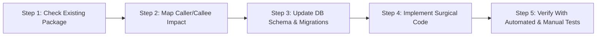

# 🚀 PROJECT STATE V3: Billket Enterprise Scale, Monetization & Compliance Roadmap

> **Document Status:** Master Architectural Blueprint & Living Execution Roadmap  
> **Target:** Complete Multi-User RBAC, Razorpay Subscriptions, Govt-Compliant Sandbox.co.in (GSTIN, E-Invoice & E-Way Bill), Sentry Crash Telemetry, and Cloud Sync Stabilization  
> **Benchmark Standards:** Vyapar, myBillBook, and Zoho Books  
> **Core Engineering Philosophy:** *"Think more, code less. Perform impact analysis before every edit. Never reinvent a package that already solves the problem. Deliver stunning, uncompromised UI aesthetics."*  
> **Last Updated:** 2026-10-07  

---

## 📌 Table of Contents
1. [Core Engineering Directives & Golden Rules](#1-core-engineering-directives--golden-rules)
2. [Current Architecture & State Audit](#2-current-architecture--state-audit)
3. [Impact Analysis & Package-First Protocol](#3-impact-analysis--package-first-protocol)
4. [Master Phased Implementation Roadmap](#4-master-phased-implementation-roadmap)
   - [Phase 1: Cloud Sync Repair & Test-Unblocking OTP Login](#phase-1-cloud-sync-repair--test-unblocking-otp-login)
   - [Phase 2: Multi-User Mode (RBAC) & Phone-Based Role Login](#phase-2-multi-user-mode-rbac--phone-based-role-login)
   - [Phase 3: Razorpay Payment Gateway & Subscription Licensing Engine](#phase-3-razorpay-payment-gateway--subscription-licensing-engine)
   - [Phase 4: Sandbox.co.in Integration (GSTIN Autofill, E-Invoice & E-Way Bill)](#phase-4-sandboxcoin-integration-gstin-autofill-e-invoice--e-way-bill)
   - [Phase 5: Sentry Crash Reporting & Telemetry](#phase-5-sentry-crash-reporting--telemetry)
   - [Phase 6: Production SMS Gateway Finalization](#phase-6-production-sms-gateway-finalization)
5. [User Deliverable Checklist (What You Need to Provide Per Phase)](#5-user-deliverable-checklist-what-you-need-to-provide-per-phase)
6. [Testing & Verification Protocol (Step-by-Step for Every Phase)](#6-testing--verification-protocol-step-by-step-for-every-phase)

---

## 1. Core Engineering Directives & Golden Rules

### Rule 1: Zero Compromise on UI/UX Aesthetics
* **The "Vyapar / BillBook" Wow-Factor:** The interface must look modern, polished, and unmistakably professional.
* **Palette & Contrast:** Curated modern palette (`#4F46E5` Indigo, `#7C3AED` Purple, `#0F172A` Slate Dark, `#16A34A` Emerald, `#DC2626` Rose Red). No browser defaults, no plain primary colors.
* **Micro-Interactions & Responsive State:** Every tap, submission, and sync action must provide tactile feedback (smooth animated badges, subtle haptics, clear loading spinners, and informative empty states).
* **High Scannability:** Clean typography hierarchy via Google Fonts `Inter`, consistent padding, and bold visual status indicators (Active/Cancelled GSTIN badges, Synced/Pending pills, Role tags).

### Rule 2: Impact Analysis First (Trace Before Touch)
* **Never edit code blindly.** Before touching any model, database column, or service method, identify:
  1. Which upstream screens display or collect this data?
  2. Which downstream services (Accounting Ledger, GST engine, PDF invoice generator, Sync queue) consume this data?
  3. How will SQLite migrations and PostgreSQL Prisma schemas stay in perfect lockstep?
* Ensure all changes are backward-compatible with local offline databases.

### Rule 3: Package-First Approach ("Think More, Code Less")
* **Never write 300 lines of custom logic when an established, battle-tested package already solves it.**
* Examples:
  - Razorpay: Use `razorpay_flutter` on mobile and official `razorpay-node` on AWS.
  - Sentry: Use `sentry_flutter` and `@sentry/node`.
  - QR Codes: Use `qr_flutter` for signed e-invoice QR rendering.
* Keep custom code focused strictly on business logic and seamless UI orchestration.

### Rule 4: Local SQLite Sovereignty & Cloud Delta Sync
* The app is **Offline-First**. Billing, party selection, and thermal printing MUST continue working even when internet drops.
* AWS Backend acts as the cloud vault, backup manager, and gateway to third-party secure APIs (Sandbox, Razorpay, SMS).
* Secrets (Sandbox Secret, Razorpay Key Secret, JWT Private Keys) **never live in the Flutter APK**. They execute securely on AWS EC2.

---

## 2. Current Architecture & State Audit

```
┌─────────────────────────────────────────────────────────────┐
│                 Flutter Client (Mobile / POS)               │
│  SQLite (sqflite) ──> Local Repository ──> UI Views / Bloc  │
│                           │                                 │
│                  SyncEngine (HTTP REST)                     │
└───────────────────────────┼─────────────────────────────────┘
                            ▼ HTTPS
┌─────────────────────────────────────────────────────────────┐
│                 AWS EC2 Backend (ap-south-1)                │
│  Fastify REST API (Port 80/4000) ──> PostgreSQL 16 (Alpine) │
│                           │                                 │
│        Third-Party External Integrations (Proxied)          │
│   ├── Sandbox.co.in (GSTIN, E-Invoice IRN, E-Way Bill)      │
│   ├── Razorpay (Orders, Subscriptions, Webhooks)            │
│   └── Sentry (Exception Tracking & Telemetry)               │
└─────────────────────────────────────────────────────────────┘
```

### Baseline Status Matrix

| Component | Current State | Target State in V3 |
| :--- | :--- | :--- |
| **AWS Server** | Online at `http://43.204.237.49:80` with Fastify & PostgreSQL | Enhanced with Razorpay, Sandbox, and Sentry routes |
| **Cloud Sync** | Failing due to Dart `String as num?` type cast & unmapped entities | 100% resilient bidirectional delta sync |
| **Auth System** | Google Sign-In only (blocked without SHA-1/Google keys) | Phone + OTP (Test bypass `1234` now, real SMS gateway later) |
| **Multi-User RBAC** | UI components built; needs role-based session login & guards | Complete login role selection, owner phone assignment, UI lockdown |
| **GSTIN Autofill** | Basic regex & Jamku public scraping | Official Sandbox.co.in API with structured Legal vs Trade names & addresses |
| **E-Invoice (IRN)** | Schema fields in DB, but no generation logic | Full NIC Schema v1.03 payload generation, Signed QR on PDF, 24h cancellation |
| **E-Way Bill** | Basic DB columns (`eway_bill_number`, `vehicle_number`) | Standalone & IRN-linked EWB generation, Part A/B management, slip PDF |
| **Subscription** | Backend schema has tier columns (`pro`, `trial`), admin UI exists | Razorpay payment flow, in-app upgrade modal, active tier capability gates |
| **Crash Telemetry** | None | Full Sentry integration across Flutter & AWS Fastify |

---

## 3. Impact Analysis & Package-First Protocol

Before starting each phase, follow this protocol:



1. **Check Existing Packages:** Scan `pubspec.yaml` and `backend/package.json` to verify if required tools already exist.
2. **Caller/Callee Impact Analysis:**
   - *Example:* Editing `GstBusinessInfo` impacts `party_form.dart`, `business_setup_screen.dart`, `gst_setup_widget.dart`, and `invoice_screen.dart`.
   - *Example:* Changing `Session.role` impacts all permission helpers: `canViewCosts`, `canViewPL`, `canViewBankBalances`, `canManageStaff`, `canEditInvoice`.
3. **Paise Precision:** Verify monetary inputs are always integers in paise (`paise = rupees * 100`).

---

## 4. Master Phased Implementation Roadmap

---

### Phase 1: Cloud Sync Repair & Test-Unblocking OTP Login [COMPLETED ✅]
**Goal:** Fix all sync-breaking bugs and give developers/testers immediate phone OTP login (`1234`) without waiting for external SMS credentials.

#### What Was Implemented & Verified:
1. **Fixed `repositories.dart` Type Casts:**
   - Implemented `_safeInt()` and `_safeDouble()` defensive converters across `reconcileRemoteChange` preventing all crashes when PostgreSQL sends CUID strings or string numbers.
   - Fixed entities: `customer`, `product`, `stock_move`, `invoice`, `payment`, `expense`, `supplier`, `bank_account`, and `cheque`.
2. **Fixed Idempotency Key in `sync.ts` & `repositories.dart`:**
   - Added timestamp hash to `idempotency_key` so edits and retries are never skipped by backend.
   - Updated `backend/src/services/sync.ts` `enqueueSync()` to process retry items.
3. **Added Missing Sync Handlers:**
   - Added payload serializer for `purchase` and `staff` in `resolveSyncPayload`.
   - Added backend `handleUpsert` and `handleDelete` for `purchase` / `purchases`.
4. **Implemented Phone + Test OTP Login UI (`login_screen.dart`):**
   - Built a sleek Phone Number + OTP card featuring Indian flag prefix `🇮🇳 +91`, 10-digit number validation, instant Test Mode auto-fill chip (`9876543210` with OTP `1234`), 4-digit OTP input, and resend/edit number options.
   - Successfully verified against live AWS Fastify endpoint `POST /api/v1/auth/phone/verify` at `http://43.204.237.49:80`.
   - All 225 Flutter tests passing with zero failures.

#### How to Test Phase 1:
1. Open app ➔ Go to Login.
2. Either tap **"Test Mode: Auto-fill 9876543210 (OTP: 1234)"** or enter phone `9876543210`.
3. Tap "Get OTP" ➔ Enter `1234` (or `0000`) ➔ Tap "Verify & Continue".
4. Verify session links immediately and cloud sync triggers.
5. Go to **More ➔ Cloud Sync** ➔ Tap "Sync Now" ➔ Verify status turns green with *"Cloud sync complete: Up to date"*.

#### Status for Next Phase:
* Phase 1 is **100% COMPLETE & VERIFIED**. Ready to begin **Phase 2: Multi-User Mode (RBAC) & Phone-Based Role Login**.

---

### Phase 2: Multi-User Mode (RBAC) & Phone-Based Role Login
**Goal:** Enable business owners to add staff members by phone number, allow staff to log in with their respective roles, and enforce strict capability restrictions across the app.

#### What Needs to Be Done:
1. **Owner Staff Management UI:**
   - Enhance `staff_form_sheet.dart` to allow entering staff member's Name, Phone Number, Role, and optional 4-digit PIN.
   - Save to SQLite `staff_members` and sync to AWS backend PostgreSQL `StaffMember`.
2. **Staff Login Flow (`login_screen.dart`):**
   - When a phone number is entered that is registered under a business as a staff member, present the **Role Selector Card**.
   - If a PIN is configured, verify PIN locally or against cloud token.
   - Switch `Session` into the staff role (e.g., `UserRole.cashier`, `UserRole.salesman`).
3. **UI Permission Enforcements:**
   - **Cashier (Biller):**
     * Can create sales and print receipts.
     * **Hidden:** Cost prices on product cards, Profit & Loss reports, Bank balances, Staff menu, Delete bill action.
     * **15-Minute Bill Lock:** Cannot edit invoices older than 15 minutes without Owner override.
   - **Salesman:**
     * Can create quotations and sales orders.
     * **Hidden:** Purchase screens, vendor payables, P&L, bank balances.
   - **Accountant / CA:**
     * Full read access to Daybook, P&L, Balance Sheet, GST reports, and Tally Prime XML export.
     * Cannot alter inventory stock directly or manage staff.

#### How to Test Phase 2:
1. Log in as **Owner**. Go to **More ➔ Staff & Permissions ➔ Add Staff Member**.
2. Add a staff member: Name: *"Rahul Cashier"*, Phone: `9111122222`, Role: **Cashier**, PIN: `1122`.
3. Log out or switch role using the simulation card.
4. Log in using phone `9111122222` and OTP `1234`.
5. Enter PIN `1122` ➔ App opens in **Cashier Mode**.
6. Verify:
   - Dashboard hides Profit & Loss card and Total Cost figures.
   - Product list hides Purchase Price column.
   - Attempting to edit an older invoice displays *"Bill locked — Owner authorization required"*.

#### What to Provide for the Next Phase:
* **The Subscription Pricing & Abilities Matrix:** The document or text listing your plan names (e.g. Starter, Pro, Enterprise), pricing (monthly/annual), and exact features unlocked for each plan.
* **Razorpay Test Keys:** `rzp_test_xxxxxx` (Key ID) and Key Secret (from [dashboard.razorpay.com](https://dashboard.razorpay.com)).

---

### Phase 3: Razorpay Payment Gateway & Subscription Licensing Engine
**Goal:** Implement full monetization and subscription gates using Razorpay, allowing business owners to purchase and renew plans directly from the app.

#### Packages to Use:
* Flutter: `razorpay_flutter: ^1.3.7`
* Backend: `razorpay-node`

#### What Needs to Be Done:
1. **Backend Razorpay Service (`backend/src/services/razorpay.ts`):**
   - `POST /api/v1/subscription/create-order`: Calls Razorpay `orders.create()` with plan amount and business ID.
   - `POST /api/v1/subscription/verify-payment`: Verifies HMAC SHA256 signature (`razorpay_order_id`, `razorpay_payment_id`, `razorpay_signature`).
   - Updates `Business.subscriptionTier` and extends `Business.subscriptionExpiresAt` in PostgreSQL.
   - `POST /api/v1/subscription/webhook`: Handles background payment renewal and failure webhooks.
2. **Flutter Subscription UI (`app/lib/features/subscription/`):**
   - **Subscription Plans Screen:** Beautiful modern comparison carousel (Starter vs Pro vs Enterprise) showing billing cycle toggle (Monthly / Yearly discount).
   - Dynamic plan features checklist with clear visual icons.
   - 1-tap "Upgrade to Pro" button triggering Razorpay Checkout sheet (UPI, GPay, PhonePe, Cards, NetBanking).
3. **Feature Gating Engine:**
   - Connect `Business.subscriptionTier` to app capabilities:
     * Free: Up to 50 bills/month, local storage only.
     * Pro: Unlimited bills, cloud sync, multi-device backup, GSTR reports.
     * Enterprise: E-Invoice (IRN), E-Way Bill, Multi-User Staff roles.
   - Clean, non-intrusive upgrade prompt when a locked feature is tapped.

#### How to Test Phase 3:
1. Go to **More ➔ Subscription & Upgrade**.
2. Select **Pro Plan (₹1,999/year)** ➔ Tap **Upgrade Now**.
3. Razorpay test modal opens ➔ Select **UPI / Test Success**.
4. Payment completes ➔ Modal dismisses ➔ Success confetti/toast appears.
5. Account status immediately reflects: **Active Pro Member (Valid until Oct 2027)**.
6. Verify previously gated feature (e.g. Cloud Sync or Multi-Device) is unlocked.

#### What to Provide for the Next Phase:
* **Sandbox.co.in API Credentials:** `x-api-key` and `x-api-secret` from your [sandbox.co.in](https://sandbox.co.in) developer portal.
* Your test GSTIN numbers for verification and invoicing.

---

### Phase 4: Sandbox.co.in Integration (GSTIN Autofill, E-Invoice & E-Way Bill)
**Goal:** Implement full government compliance identical to BillBook and Vyapar using Sandbox.co.in APIs proxied through the AWS backend.

#### What Needs to Be Done:
1. **Backend Sandbox Client (`backend/src/services/sandbox.ts`):**
   - Access token caching and automatic refresh worker.
   - Endpoint: `GET /api/v1/gst/lookup/:gstin` ➔ Returns sanitized JSON with separate `tradeName`, `legalName`, `billingAddress`, `shippingAddress`, `pincode`, `state`, `pan`, and `status`.
   - Endpoint: `POST /api/v1/einvoice/generate` ➔ Formats invoice into official NIC Schema v1.03 JSON, submits to Sandbox, receives `Irn`, `AckNo`, `AckDt`, and `SignedQRCode`.
   - Endpoint: `POST /api/v1/einvoice/cancel` ➔ Cancels IRN within 24 hours.
   - Endpoint: `POST /api/v1/ewaybill/generate` ➔ Generates 12-digit E-Way Bill.
   - Endpoint: `POST /api/v1/ewaybill/update-vehicle` ➔ Part B update.
2. **Party Form GSTIN Autofill (BillBook & Vyapar Standard):**
   - Entering 15 digits triggers live lookup.
   - **Trade Name** fills Party Name; **Legal Name** fills Legal Entity field.
   - Split billing address into Building/Street, City, State, and Pincode.
   - "Shipping address same as billing address" toggle (with option to pick secondary warehouse if available).
   - Green **Active** or Red **Cancelled** GST badge with registration date.
3. **E-Invoice in Sales UI:**
   - Eligible B2B invoices show prominent **"Generate E-Invoice"** button.
   - Validates HSN, Pin codes, and tax rates before network call.
   - Displays live status card with 64-char IRN, Ack No, and Copy button.
   - Invoice PDF renders official scannable **Signed QR Code** on top-right corner.
4. **E-Way Bill in Sales UI:**
   - Invoices over ₹50,000 prompt for E-Way Bill generation.
   - Bottom sheet for Transporter ID/Name, Distance in KM, Vehicle Number, and LR/RR No.
   - Live EWB validity countdown timer (*"Valid for 2 days"*).
   - Generates official printable E-Way Bill slip.

#### How to Test Phase 4:
1. Go to **Parties ➔ Add Party** ➔ Enter a valid test GSTIN.
2. Verify all fields auto-fill cleanly (Trade name in Party Name, structured street, city, state, pin).
3. Create a B2B sale to this party with HSN codes.
4. Finalize invoice ➔ Tap **"Generate E-Invoice"**.
5. Server generates IRN ➔ Live green banner appears: **E-Invoice Active (IRN: 8a9f...b3)**.
6. Tap **View PDF** ➔ Verify Signed QR Code is printed clearly on the invoice header.
7. Tap **"Generate E-Way Bill"** ➔ Fill vehicle `MH12AB1234` ➔ Verify 12-digit EWB is issued.

#### What to Provide for the Next Phase:
* **Sentry DSNs:**
  - Flutter DSN (`https://xxx@xxx.ingest.sentry.io/xxx`)
  - Node.js DSN for AWS backend

---

### Phase 5: Sentry Crash Reporting & Telemetry
**Goal:** Implement automated, real-time crash reporting and health telemetry across client devices and AWS backend.

#### Packages to Use:
* Flutter: `sentry_flutter: ^8.11.0`
* Backend: `@sentry/node: ^8.0.0`

#### What Needs to Be Done:
1. **Flutter App Integration:**
   - Initialize `SentryFlutter` inside `main.dart`.
   - Capture uncaught Flutter/UI errors and background SQLite failures.
   - Attach breadcrumbs for sync triggers, offline transitions, and database transactions.
2. **AWS Fastify Integration:**
   - Sentry Fastify error handler capturing unhandled HTTP 500s, database connection drops, and third-party API timeout spikes.

#### How to Test Phase 5:
1. Trigger a test diagnostic event in **More ➔ Diagnostics ➔ Test Sentry Alert**.
2. Open Sentry dashboard ➔ Verify event appears with OS, device model, and stack trace.

#### What to Provide for the Next Phase:
* **Production SMS Gateway Credentials:** API Key, Sender ID, and template IDs from your SMS vendor (Twilio, MSG91, or Fast2SMS).

---

### Phase 6: Production SMS Gateway Finalization
**Goal:** Swap out the development test OTP (`1234`) with real SMS delivery to live phone numbers in production.

#### What Needs to Be Done:
1. Update `backend/src/services/auth.ts`:
   - Replace test OTP check with dynamic 6-digit cryptographic OTP generation.
   - Store OTP with 5-minute expiry in PostgreSQL / Redis.
   - Dispatch SMS via vendor REST API.
2. Update Flutter `login_screen.dart`:
   - Hide the development "Test Mode: Use 1234" helper chip in release builds (`kReleaseMode`).
   - Add "Resend OTP in 30s" countdown timer.

#### How to Test Phase 6:
1. Enter your real mobile number ➔ Tap "Get OTP".
2. Receive SMS on your physical mobile phone within 5 seconds.
3. Enter received OTP ➔ Successfully logs into Billket Cloud.

---

## 5. User Deliverable Checklist (What You Need to Provide Per Phase)

| Phase | What the Developer Needs From You |
| :--- | :--- |
| **Phase 1 (Sync Fix & OTP UI)** | *Nothing needed right now!* Fully testable using mock OTP `1234` against live AWS. |
| **Phase 2 (Multi-User RBAC)** | Confirm exact role names and confirm if staff members need mandatory 4-digit PINs. |
| **Phase 3 (Razorpay Subscription)** | **1.** Your subscription pricing file (Plan names, prices, feature capabilities).<br>**2.** Razorpay Test Key ID & Secret. |
| **Phase 4 (Sandbox.co.in Compliance)** | **1.** Sandbox.co.in API Key & Secret.<br>**2.** Test GSTIN numbers for testing. |
| **Phase 5 (Sentry Telemetry)** | Sentry DSN URLs for Flutter and Node.js. |
| **Phase 6 (Production SMS)** | Live SMS Gateway API credentials (Twilio, Fast2SMS, or MSG91). |

---

## 6. Testing & Verification Protocol (Step-by-Step for Every Phase)

For every single phase implemented, we will run the following verification suite:

1. **Static Analysis & Lints:**
   - Flutter: `flutter analyze` ➔ Must return 0 errors.
   - Backend: `npm run lint` / TypeScript build ➔ 0 errors.
2. **Automated Regression Suite:**
   - Flutter: Run all unit & repository tests (`flutter test`) ➔ 100% pass rate.
   - Backend: Run Fastify test suite ➔ 100% pass rate.
3. **Live AWS Verification:**
   - Execute live curl or client test against AWS EC2 (`43.204.237.49`) to verify the endpoint in real cloud runtime.
4. **Interactive UI Walkthrough:**
   - Verify smooth transitions, correct color tokens, proper font styles, and responsive touch targets.
